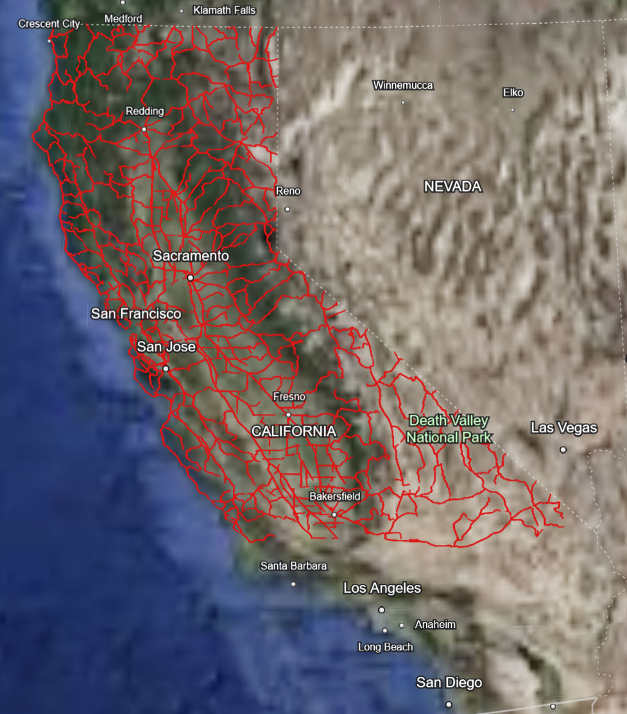

# The Graphene

`Graphene` is a header-only library that implements an abstract graph. The class template allows
creation of graphs of any types of nodes both directed and undirected with
the custom weight function.

[](https://github.com/vahancho/graphene/releases)
[](https://github.com/vahancho/graphene/actions/workflows/cmake.yml)
[](https://codecov.io/gh/vahancho/graphene)

## Prerequisites

No special requirements except *C++17* compliant compiler. The class is tested with
*gcc* and *MSVC* compilers. In order to build and run unit tests
for this project you are required to have Google Test library installed on the system.
For more details see the CI badges or [GitHub Actions](https://github.com/vahancho/graphene/actions).

## Shortest paths

The library calculates shortest path between two nodes using the Dijkstra algorithm.
However the term "shortest" is an abstraction, because the distance between
to nodes is just a particular notion of the weight of the graph edge. `Graphene`
allows to define custom weight functions, so that the algorithm will calculate
not only the shortest path, but the path that corresponds to the minimal overall
"weight".

## API and usage

```cpp
#include "graphene.h"

// Declare a graph with nodes as integer values
Graphene<int> graph;

graph.addNode(0);
graph.addNode(42);

graph.addEdge(0, 42);
graph.addEdge(1, 2);

```

Calculate the shortest path between two nodes

```cpp
#include "graphene.h"

// 1--2--5--8
//  \     \/
//   10---6---7
//
Graphene<int> graph;

auto weightFunction = [](int x, int y) -> int {
    return std::abs(x - y);
};

graph.addEdge(1, 2);
graph.addEdge(2, 5);
graph.addEdge(5, 6);
graph.addEdge(5, 8);
graph.addEdge(8, 6);
graph.addEdge(1, 10);
graph.addEdge(10, 6);
graph.addEdge(6, 7);

path = graph.shortestPath(1, 6, weightFunction);
// path = {1, 2, 5, 6}
```

## Example (California road network)

The `roadmap` example demonstrates how to use `Graphene` library to create a road
map. As an input we used the [California Road Network]
(https://users.cs.utah.edu/~lifeifei/SpatialDataset.htm) which represented by two files:
`/examples/data/nodes_lon_lat.txt` with the nodes' geodetic coordinates and
`/examples/data/edges.txt` file with nodes indexes and distance between them.
Using this data we created an undirected graph and use `Graphene::shortestPaths()`
function to find all paths that connect a node with all others. The tool exports
the results as a [KML](https://en.wikipedia.org/wiki/Keyhole_Markup_Language) file
which can be loaded, for example, into Google Earth application for visualization.



# See also

[California Road Network](https://users.cs.utah.edu/~lifeifei/SpatialDataset.htm)
